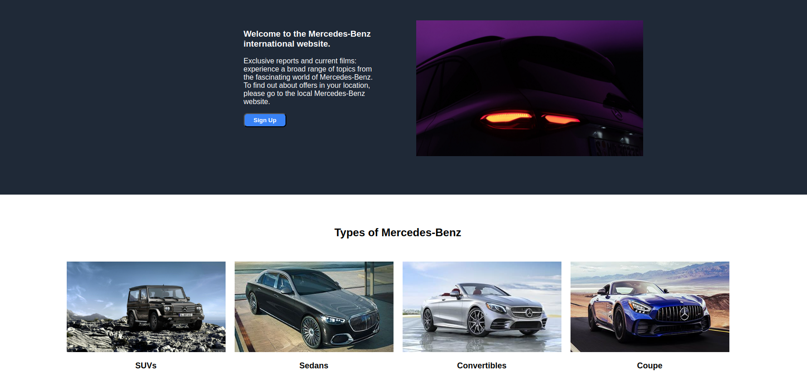

# <a href="https://a07k.github.io/Mercedes/">Mercedes-Benz Webpage Project</a>

  <h2>Description</h2>
    
This project is a beginner-level webpage showcasing Mercedes-Benz. It's a static HTML/CSS implementation featuring various sections about the brand and its car types.

  <h2>Features</h2>
    <ul>
        <li>Responsive header with Mercedes-Benz logo and navigation menu</li>
        <li>Welcome section with an introductory message and sign-up button</li>
        <li>Display of different Mercedes-Benz car types with images</li>
        <li>Motivational quote section</li>
        <li>Call-to-action section for signing up</li>
        <li>Footer with copyright information</li>
    </ul>
    <h2>Structure</h2>
    <ul>
        <li>Header: Logo and navigation links</li>
        <li>Welcome section: Intro text and image</li>
        <li>Car types section: SUVs, Sedans, Convertibles, Coupe</li>
        <li>Quote section</li>
        <li>Sign-up section</li>
        <li>Footer</li>
    </ul>
    <h2>Technologies Used</h2>
    <ul>
        <li>HTML5</li>
        <li>CSS3 (linked file: propercss.css)</li>
    </ul>
    <h2>Assets</h2>
    <ul>
        <li>Mercedes-Benz logo (Mercedes-Logo.svg)</li>
        <li>Favicon (icon-mercedes.png)</li>
        <li>Background image (mercedes-background.jpeg)</li>
        <li>Car type images (SUVs.jpg, Sedans.jpg, convertibles.jpg, coupe.jpg)</li>
    </ul>
    <h2>Setup</h2>
    
To view this project, simply open the HTML file in a web browser. Ensure that all referenced image files and the CSS file (propercss.css) are in the correct directory relative to the HTML file.

    <h2>Learning Outcomes</h2>
    <ul>
        <li>Basic HTML structure and elements</li>
        <li>CSS styling and layout techniques</li>
        <li>Responsive design principles</li>
        <li>Image integration in web pages</li>
    </ul>
    <h2>Future Improvements</h2>
    <ul>
        <li>Add JavaScript for interactivity</li>
        <li>Implement a fully responsive design for all screen sizes</li>
        <li>Create additional pages for 'About', 'Showrooms', and 'Contact' sections</li>
        <li>Enhance accessibility features</li>
    </ul>

  <h2>Acknowledgements</h2>
    
This project was created as part of The Odin Project curriculum, serving as a practical exercise in HTML and CSS.

